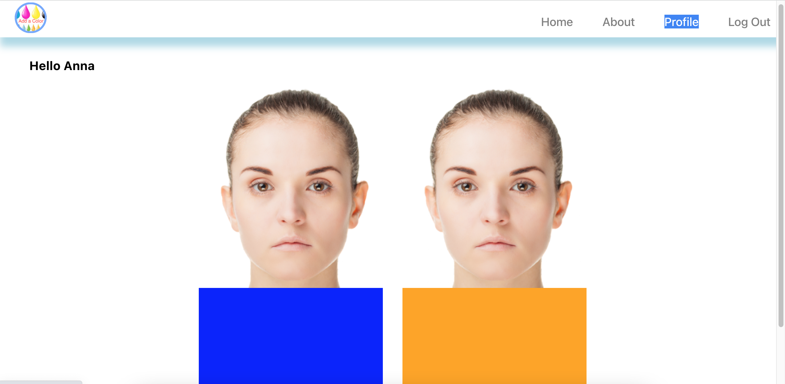

# AddAColor

Discover the perfect colors for your wardrobe with "AddAColor," a MERN application written in Typescript. By simply uploading your photos, this app utilizes intelligent color analysis algorithms to generate two variants of your image against different color backgrounds. Explore and compare the variants to choose the one that suits you the best. Gain valuable insights into the impact of colors on your everyday style, helping you choose the ideal hues for your wardrobe.

Additionally, "AddAColor" provides a curated palette of complementary colors based on color theory and harmonious combinations, empowering you to select colors that effortlessly suit your personal taste and enhance your fashion choices. Elevate your wardrobe and create stylish ensembles with a world of color possibilities tailored to your individual style and expression.

